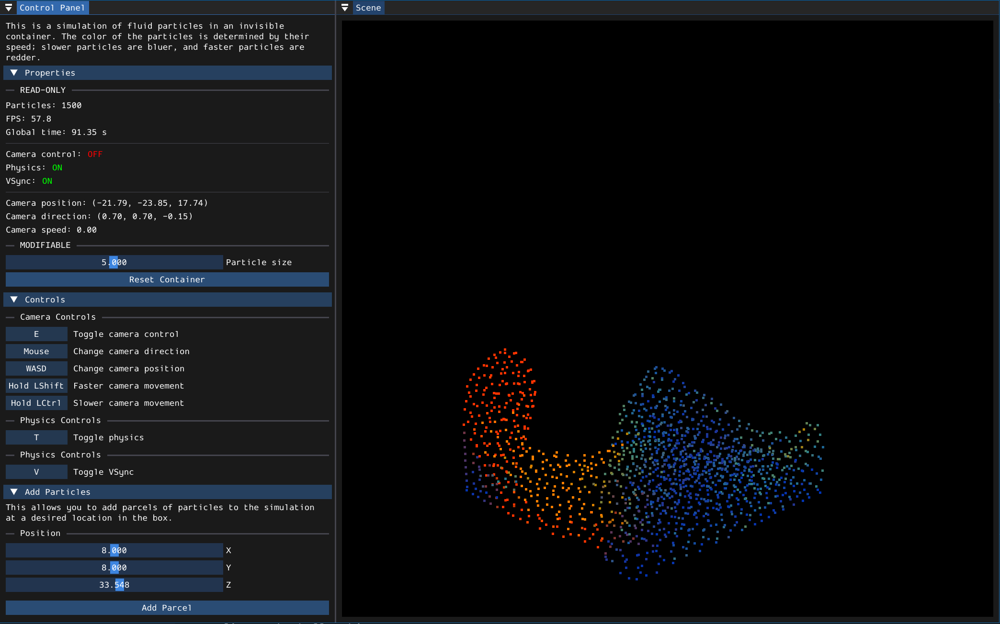

## Description

CS 179 Final Project: Markus Lendermann & Dominic Phung

This program is a GUI-based fluid dynamics simulator; as such, it cannot be used via just the command-line. OpenGL 4.1 is required to run this program.



## CUDA acceleration
Comments detailing how this program will be parallelized to run on a GPU with CUDA can be found in `physics.cpp`.

## Compilation Instructions

This project requires the following tools:

- `CMake` (>= 3.12)
- A C compiler
- A C++ compiler that supports C++17
- A build system (e.g., `make`)

For simplicity, we assume the use of `make` as the build system on all platforms. Platform-specific instructions for setting up the required toolchain are provided below. To compile the project, run the following commands in the root directory:

```
mkdir build
cd build
cmake -G "Unix Makefiles" ..
make
```
On some systems, `make` may have a different name (e.g., `mingw32-make` on `MinGW-w64`). Adjust the final command accordingly.

After the above commands complete successfully, the executable `cs179-project` (or `cs179-project.exe` on Windows) will be located in the build directory.

## Platform-Specific Toolchain Setup

### Windows (64-bit)

#### Tool setup
The simplest way to set up the toolchain on Windows is by using the `MinGW-w64` toolchain. Follow these steps:

1. Navigate to [https://winlibs.com](https://winlibs.com)
2. Scroll to the "Downloads" section
3. Download GCC 14.1.0 (with POSIX threads), which supports C++20:
    - Choose the UCRT runtime
    - Choose Win64 (either version with or without LLVM/Clang/LLD/LLDB)
    - Choose either the 7-zip or zip archive format
4. Extract the downloaded file
5. (Optional) Move the `mingw64` folder inside the extracted file to a preferred location (e.g. `C:\mingw64`)
6. Add the `bin` folder inside the `mingw64` directory to the `PATH` environment variable

To verify the setup, run the following commands in the Command Prompt:
```
cmake --version
g++ --version
gcc --version
mingw32-make --version
```

If these commands fail, ensure the `PATH` environment variable includes the `mingw64\bin` directory and restart your terminal or VSCode to apply the changes.

#### Compile the program
To compile the program on Windows, run the following commands in the root directory using Command Prompt:

```
mkdir build
cd build
cmake -G "Unix Makefiles" ..
mingw32-make
```

This will generate an executable called `cs179-project.exe` inside the `build` folder.


### MacOS

#### Tool Setup

The simplest way to get all the necessary tools is to install Homebrew, since that installs the Xcode command line tools. The installation steps for Homebrew are on [https://brew.sh/](https://brew.sh/).

Then, `cmake` can be installed via the command `brew install cmake`. At this point, all the necessary tools should be installed.

#### Compile the program

To compile the program on MacOS, run the following commands in the root directory:

```
mkdir build
cd build
cmake -G "Unix Makefiles" ..
make
```

This will generate an executable called `cs179-project` inside the `build` folder.